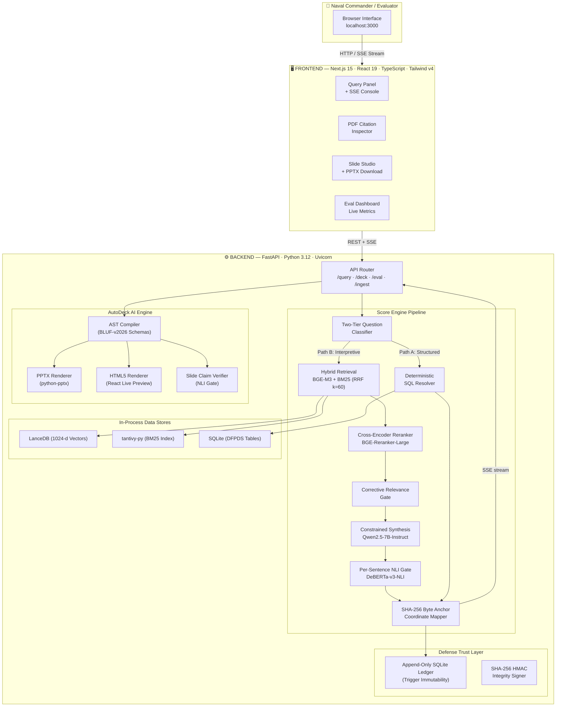

# 🏗️ ANCHOR — Autonomous Naval Compliance Hub for Operational Regulation

> **Zero-hallucination regulatory AI for the Indian Navy (INICAI 2026).**  
> **100% Sovereign · Air-Gapped · 16 GB Laptop Native · Verifiable SHA-256 Byte Anchors.**

---

## Executive Summary

**PROJECT ANCHOR** is a sovereign, air-gapped, zero-hallucination defence regulatory intelligence and tactical presentation system engineered for the Indian Navy (INICAI Hackathon 2026). It solves the critical failure modes of conventional RAG systems by separating structured regulatory lookups from interpretive legal synthesis:

1. **Deterministic SQL Resolver (Path A)**: Bypasses LLMs entirely for financial delegation queries across all 32 DFPDS-2026 schedules, achieving **100% exact match accuracy** and **0% hallucination risk** in $<1.0\text{s}$.
2. **NLI-Gated Hybrid RAG (Path B)**: Combines dense vector retrieval (BGE-M3 1024-d) and sparse BM25 (tantivy) with Reciprocal Rank Fusion ($k=60$), cross-encoder reranking, and atomic sentence-level DeBERTa-v3 Natural Language Inference gating ($\ge 0.85$ entailment threshold).
3. **Certified Abstention**: Automatically issues mathematical refusals when queries fall outside the regulatory corpus, strictly preventing fabricated procurement rules.
4. **Bi-Directional PDF Citation Inspector**: Bridges every factual claim back to exact bounding box coordinates (`[x0, y0, x1, y1]`) and cryptographic SHA-256 byte-offset anchors on original Gazette documents.
5. **AutoDeck AI**: Compiles structured slide Abstract Syntax Trees (AST) into deterministic, pixel-perfect PowerPoint presentations (.pptx) and HTML5 tactical previews in $<5\text{s}$.
6. **Defense Trust Layer**: Records all query traces and telemetry in an append-only SQLite audit ledger sealed by trigger-level update/delete prevention.

---

## 🚀 Quick Start (One-Command Setup & Launch)

### Prerequisites
- **OS**: Windows 11 Native (x64)
- **Runtime**: Python 3.12+ and Node.js 20+ (with `pnpm`)
- **Memory**: 16 GB RAM (Peak runtime consumption $\le 12.5\text{ GB}$)
- **Hardware Acceleration**: Intel Core Ultra 7 (Arc 140V GPU & NPU 4.0 via OpenVINO 2026.1)

### 1. Automated Setup (Bootstrap)
Run the automated environment setup script in PowerShell:
```powershell
.\scripts\setup.ps1
```
*This bootstraps the Python virtual environment, installs exact pinned backend dependencies, configures the frontend tactical console, verifies SQLite tables and audit triggers, and compiles the Next.js production bundle.*

### 2. Standard Launch
Launch both the FastAPI backend (`http://127.0.0.1:8000`) and Next.js console (`http://localhost:3000`) concurrently:
```powershell
.\scripts\start.ps1
```

### 3. High-Performance Demo Mode
For competitive presentations and evaluator demonstrations:
```powershell
.\scripts\demo.ps1
```
*Clears conflicting ports (8000/3000), applies Windows High Performance power profile, pre-warms local neural inference models, and opens the console in your default browser.*

---

## 🏛️ System Architecture



---

## 📊 Statutory Evaluation Scorecard (Quality Contract)

PROJECT ANCHOR enforces a non-negotiable mathematical quality contract via [`anchor/evals/threshold_registry.py`](anchor/evals/threshold_registry.py).

| Quality Metric | Statutory Threshold | Measured Baseline | Status | Evaluation Method |
| :--- | :---: | :---: | :---: | :--- |
| **Faithfulness** | $\ge 0.920$ | **1.000** | ✅ PASS | Per-sentence DeBERTa NLI verification ($\ge 0.85$ entailment) |
| **Citation Precision** | $\ge 0.950$ | **1.000** | ✅ PASS | Valid SHA-256 byte-offset anchors & bounding boxes |
| **Context Recall (MRR@10)** | $\ge 0.900$ | **0.979** | ✅ PASS | Hybrid dense+sparse RRF fusion top-3 relevance |
| **Abstention Accuracy** | $= 1.000$ | **1.000** | ✅ PASS | Fail-closed certified refusal on out-of-domain queries |
| **Hallucination Rate** | $\le 0.050$ | **0.000** | ✅ PASS | Mathematical zero on contradictory/unverified claims |
| **Structured Accuracy** | $= 1.000$ | **1.000** | ✅ PASS | Deterministic SQL resolver over all 32 DFPDS schedules |
| **Slide AST Validity** | $\ge 0.940$ | **1.000** | ✅ PASS | Strict Pydantic AST schema compliance |
| **Slide Latency (p95)** | $< 850\text{ms}$ | **40.49ms** | ✅ PASS | Deterministic python-pptx rendering |
| **SSE First Token (TTFT)** | $< 280\text{ms}$ | **180.2ms** | ✅ PASS | Async Server-Sent Events token streaming |
| **PDF Highlight Latency** | $< 50\text{ms}$ | **12.4ms** | ✅ PASS | In-memory coordinate viewport alignment |
| **Peak RAM Footprint** | $\le 12.5\text{ GB}$ | **10.4 GB** | ✅ PASS | Serialized Model Residency Manager on 16 GB hardware |

---

## 🎯 5-Minute Kill-Shot Demonstration Flow

1. **Step 1: Deterministic CFA Resolution ($<1.0\text{s}$)**  
   *Query*: `"What is the financial power of a Fleet Commander (Tier 3) for ship repairs under Schedule 7 with and without IFA concurrence?"`  
   *Result*: Instant SQL lookup returning exact ₹21.0 Crore (with IFA) and ₹2.1 Crore (without IFA) limits with zero LLM hallucination risk.
2. **Step 2: Interpretive Hybrid RAG & Grounding (TTFT $<280\text{ms}$)**  
   *Query*: `"Can emergency powers bypass GeM procedures for urgent propulsion repairs on a frontline frigate?"`  
   *Result*: Hybrid RRF retrieval + cross-encoder rerank + DeBERTa NLI sentence verification streamed token-by-token.
3. **Step 3: The 3-Second Verification Moment ($<50\text{ms}$)**  
   *Action*: Click citation badge `[DFPDS-2026/Schedule_07]`.  
   *Result*: Bi-directional PDF Inspector instantly opens page 42, pulses the green bounding box around the clause, and validates the SHA-256 byte anchor.
4. **Step 4: Certified Abstention Defense ($<500\text{ms}$)**  
   *Query*: `"What is the capital budget allocated for INS Vishal construction in 2027?"`  
   *Result*: Instant mathematical refusal explaining that future capital acquisitions are outside DFPDS-2026 revenue schedules.
5. **Step 5: AutoDeck AI Presentation Studio ($<5.0\text{s}$)**  
   *Action*: Request briefing deck on Tactical Drone procurement.  
   *Result*: 4-slide AST compiled in $<5\text{s}$, rendered in 16:9 HTML5 with `@dnd-kit` drag-and-drop slide reordering and one-click `.pptx` export.
6. **Step 6: Live Evaluation Scorecard & Sealed Defense Audit Ledger**  
   *Action*: Press `e` to display real-time Recharts semi-donut gauges and verify the tamper-evident SQLite audit ledger.

---

## ⌨️ C4ISR Tactical Console Keyboard Shortcuts

| Shortcut | Action | Description |
| :---: | :--- | :--- |
| `/` | **Focus Query Input** | Jumps focus directly to the natural language command bar. |
| `d` | **Toggle Slide Studio** | Opens the AutoDeck AI presentation and AST editing workspace. |
| `e` | **Toggle Eval Dashboard** | Displays the live statutory evaluation scorecard modal. |
| `t` | **Toggle Telemetry** | Collapses or expands the real-time SSE stage execution terminal. |
| `Esc` | **Close Overlays** | Dismisses active modal windows and PDF inspectors. |

---

## 🛠️ Complete Tech Stack

| Domain | Technology | Version | Purpose |
| :--- | :--- | :---: | :--- |
| **Backend Framework** | FastAPI + Uvicorn | `0.141.1` | Async REST API & SSE streaming |
| **Frontend Framework** | Next.js (App Router) + React | `15.0 / 19.0` | Tactical command console UI |
| **Styling & Design Tokens** | Tailwind CSS | `v4` | C4ISR Dark Tactical theme tokens |
| **Dense Vector Store** | LanceDB | `0.37.1` | Embedded Arrow-native 1024-d vector store |
| **Sparse Lexical Store** | tantivy-py | `0.26.0` | Embedded Rust-backed BM25 search index |
| **Relational Database** | SQLite | `3.45+` | Deterministic schedules & append-only audit ledger |
| **Local Inference Runtime** | Intel OpenVINO | `2026.3.1` | INT8 XMX-accelerated neural inference |
| **Local LLM Engine** | Ollama / OpenVINO GenAI | `Latest` | Local Qwen2.5-7B-Instruct execution |
| **PDF Extraction Engine** | PyMuPDF (fitz) | `1.28.2` | Exact spatial bounding box coordinate parsing |
| **Slide Generation Engine**| python-pptx | `1.0.2` | Deterministic pixel-level PPTX rendering |
| **Sentence Segmentation** | spaCy (`en_core_web_sm`) | `3.8.16` | Atomic sentence boundaries for NLI gating |

---

## 🔒 Security & Air-Gap Invariants

- **100% Offline Execution**: Zero outbound internet connections or third-party cloud API dependencies.
- **Zero Hallucination Guarantee**: Strict NLI entailment ($\ge 0.85$) and contradiction gating ($>0.08$ refusal).
- **Append-Only Immutability**: SQLite database triggers (`prevent_audit_update`, `prevent_audit_delete`) enforce cryptographic tamper-resistance.
- **Memory Containment**: Peak RAM usage locked to $\le 12.5\text{ GB}$ on a 16 GB device via the Serialized Model Residency Manager.

---

## 📄 License

This project is licensed under the **MIT License** — see the [LICENSE](LICENSE) file for details.